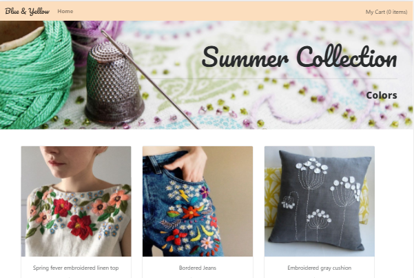
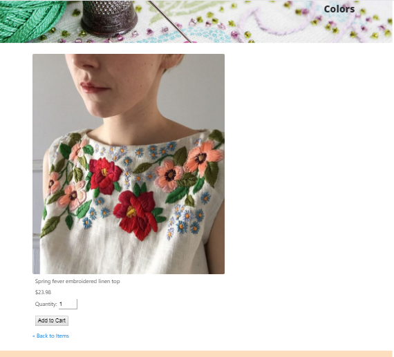

# Proyecto Blue & Yellow

Blue & Yellow es una e-commerce single page application que usa como dependencia sammy.js para crear las rutas dentro de la página. En su vista principal muestra todos los productos de la tienda y al hacer click en cada una de ellas muestra los detalles del producto, todo cargado desde un archivo json y utilizando templates.

### Vista Home
>

### Vista Item
>

## Metodología de trabajo

* Utilizamos la metodología Agile, para mejorar la eficiencia en la producción y la calidad de nuestro producto.

* Como herramienta de planificación utilizamos Trello, para tener un mayor orden en las tareas encomendadas y la claridad de lo que necesitariamos para llevar a cabo el proyecto.

* Utilizamos WhatsApp y Slack para poder mantenernos conectadas en todo momento y así tener una comunicación clara al momento de realizar cualquier cambio en el proyecto o actualizaciones.

## Requerimientos Técnicos

El proyecto fue realizado con los siguientes recursos:

* Dependencias de Producción
 - jQuery `~v.3.3.1`
 - Bootstrap `4.0.0-alpha.6`

* Dependencias de Desarrollo

 - Node.js `~v.9.4.0`
 - NPM `~v.5.6.0`
 - Express `^4.16.2`
 - Sammyjs `^0.7.6`

***